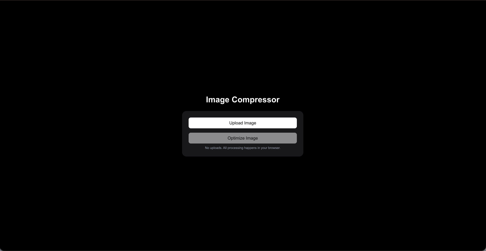

# FastUtils 🚀

Free browser-based image tools. No signup. Fast. Simple.

## 🔥 Features
- Image compression (client-side)
- No uploads → privacy friendly
- Instant results
- Works directly in browser

## 🚀 Live Demo
👉 https://fast-utils.vercel.app

## 📸 Preview

### 🏠 Home

### 🛠 Image Compressor

## 🔒 Privacy First
All image processing happens in your browser.
No files are uploaded to any server.

## 🛠 Tech Stack
- Next.js
- TypeScript
- Tailwind CSS

## ⚡ Why I built this
Most image tools either:
- require signup
- upload files to servers
- or are slow

So I built a simple tool that runs completely in the browser.

## 🚧 Roadmap
- Image resize
- Format conversion (PNG ↔ JPG)
- More utilities

## ⭐ Support
If you find this useful, consider starring the repo.
